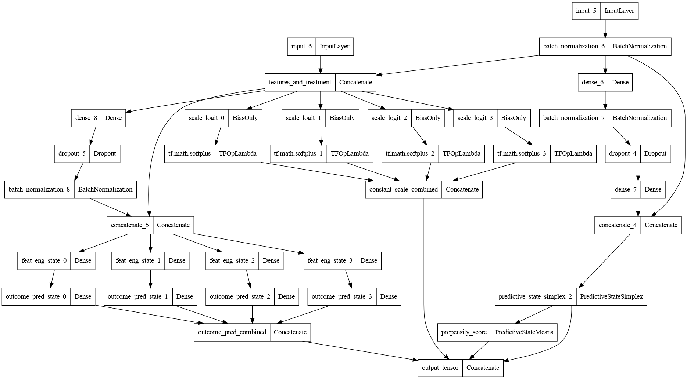
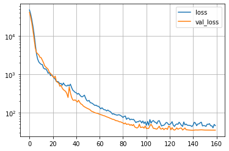

# pypsps: Predictive State Propensity Subclassification (PSPS) in Python


[](http://makeapullrequest.com)
[](https://lbesson.mit-license.org/)


```python
from pypsps.keras import models
model = models.build_toy_model(n_states=4, n_features=6)

import tensorflow as tf
tf.keras.utils.plot_model(model)
```


*Predictive State Propensity Subclassification* (**PSPS**) is a causal deep
learning algorithm for observational (non-randomized) data proposed by [Kelly,
Kong, and Goerg (2022)](https://proceedings.mlr.press/v177/kelly22a.html). PSPS
decomposes the joint distribution of Pr(outcome, treatment | features) by
conditioning on intermediate predictive states from Pr(treatment | features).
These predictive state representations are trained simultaneously to the outcome
models and provide a principled way to estimate propensity score strata to
guarantee balancedness within the strata (block).

## Implementation

`pypsps` implements the causal learning algorithm proposed in Kelly, Kong, Goerg
(2022) as custom layers, metrics, and causal loss functions. It is fully
compatible with the `tf.keras` API and all losses, layers, metrics can be used
for building comprehensive causal learning graphs suitable for any kind of causal
data / inference problem.


## General causal framework, not only binary treatment & continous outcome

PSPS is a general framework for causal learning for any treatment type (binary,
continous, multi-class, ...) and any outcome type (univariate, multivariate;
binary, continuous, multi-class, ...).

The `pypsps.keras.models` module contains `build_toy_model()` as a template of how
to build a causal PSPS model architecture for the common case of binary
treatment (T), numeric features (X) a univariate, continous outcome (Y), with a
specific hidden layer structure.  The toy model architecture can be used as a
template for constructing specific PSPS model structure for the causal dataset
at hand.


# Installation

It can be installed directly from GitHub using:

```python
pip install git+https://github.com/gmgeorg/pypsps.git
```


# Code examples


```python
import numpy as np
import pandas as pd
import matplotlib.pyplot as plt

from pypsps.keras import models
from pypsps import datasets, inference, utils

np.random.seed(10)
ks_data = datasets.KangSchafer(true_ate=20).sample(n_samples=1000)
tf.random.set_seed(10)
model = models.build_toy_model(
    n_states=4, n_features=ks_data.n_features, compile=True, alpha=10.
)
inputs, outputs = ks_data.to_keras_inputs_outputs()
history = model.fit(inputs,
                    outputs,
                    epochs=250,
                    batch_size=64,
                    verbose=2,
                    validation_split=0.2,
                    callbacks=models.recommended_callbacks(),
                    )
preds = model.predict(inputs)
outcome_pred, scale, weights, propensity_score = utils.split_y_pred(preds)

pred_ate = inference.predict_ate(model, ks_data.features)
print("ATE\n\t true: %.1f \n\tnaive: %.1f \n\t PSPS: %.1f" % (
    ks_data.true_ate, ks_data.naive_ate(), pred_ate)
    )
pd.DataFrame(history.history)[["loss", "val_loss"]].plot(logy=True); plt.grid()
```

```shell
ATE
	 true: 20.0 
	naive: -1.3 
	 PSPS: 17.3
```




**Recommendation:** If you have your own simulation study or real world dataset,
wrap it into a `datasets.base.CausalDataset()` class and proceed as above for
the `KangSchafer().sample()` example above.


### Example notebooks

* [`notebooks/pypsps_minimal_working_example.ipynb`](notebooks/pypsps_minimal_working_example.ipynb):
  how to use `pypsps` for estimateing ATE for the Kang-Schafer dataset.

* [`notebooks/pypsps_demo.ipynb`](notebooks/pypsps_demo.ipynb): more in depth code
  examples on simulated and real world datasets.

## References

[Kelly, Kong, and Goerg (2022)](https://proceedings.mlr.press/v177/kelly22a.html),
 **Predictive State Propensity Subclassification (PSPS): A causal inference
 algorithm for data-driven propensity score stratification**, Proceedings of MLR
 for the *Causal Learning and Reasoning (CLEAR) 2022*. 


## License

This project is licensed under the terms of the [MIT license](LICENSE).


**Important:** This is **NOT** an official Google code release of PSPS from the
original research paper; the repo here is not related to Google in any way.
This is simply a re-implementation of the Google research
[pre-print](https://research.google/pubs/pub49197/), with additional
improvements/extension of the original architecture.