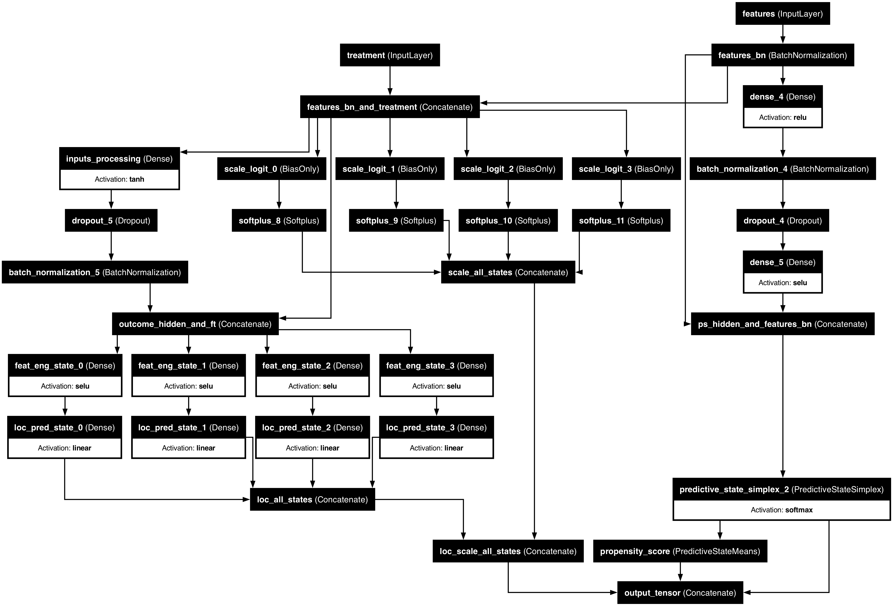
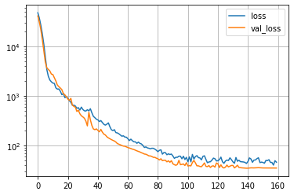

# pypsps: Predictive State Propensity Subclassification (PSPS) in Python


[](http://makeapullrequest.com)
[](https://lbesson.mit-license.org/)


```python
from pypsps.keras import models
model = models.build_toy_model(n_states=4, n_features=6)

import tensorflow as tf
tf.keras.utils.plot_model(model, show_layer_names=True, show_layer_activations=True)

```



*Predictive State Propensity Subclassification* (**PSPS**) is a causal deep
learning algorithm for observational (non-randomized) data proposed by [Kelly,
Kong, and Goerg (2022)](https://proceedings.mlr.press/v177/kelly22a.html). PSPS
decomposes the joint distribution of $\Pr(\text{outcome}, \text{treatment} \mid
\text{features})$ by conditioning on intermediate predictive states from
$\Pr(\text{treatment} \mid \text{features})$. These predictive state
representations are trained simultaneously to the outcome models and provide a
principled way to estimate propensity score strata to guarantee balancedness
within the strata (block).

For in-depth mathematical details, see References.

## Implementation & Architecture

`pypsps` implements the causal learning algorithm proposed in Kelly, Kong, Goerg
(2022) as custom layers, metrics, and causal loss functions. It is fully
compatible with the `tf.keras` API and all losses, layers, and metrics can be
used for building comprehensive causal learning graphs suitable for any kind of
causal data or inference problem.

For details on custom Keras layers, loss functions, metrics, and callbacks, see
[docs/model_building.md](docs/model_building.md).

### General Causal Framework

PSPS is a general framework for causal learning across any treatment type
(binary, continuous, multi-class) and outcome type (univariate, multivariate,
binary, continuous, survival).

The `pypsps.keras.models` module provides template builders like
`build_toy_model()` for binary treatments and continuous outcomes, which can be
adapted to your specific observational dataset.

## Documentation Overview

* **[Architecture](docs/architecture.md)**: Theoretical framework, predictive
  states, and joint distribution modeling.
* **[Development Guide](docs/development.md)**: Environment setup, testing,
  formatting, and contribution guidelines.
* **[Model Building](docs/model_building.md)**: Custom Keras layers, losses,
  metrics, and training helpers.
* **[Datasets API](docs/datasets.md)**: Using `CausalDataset` and built-in
  benchmark datasets (Kang-Schafer, LaLonde, etc.).
* **[Inference & Post-Processing](docs/inference.md)**: Computing ATE
  predictions, output splitting, and bootstrap sampling.

## Installation

Install directly from GitHub:

```bash
pip install git+https://github.com/gmgeorg/pypsps.git
```

For development setup and requirements, see
[docs/development.md](docs/development.md).

## Code Example

```python
import numpy as np
import pandas as pd
import matplotlib.pyplot as plt

from pypsps.keras import callbacks, models
from pypsps import datasets, inference, utils

np.random.seed(10)
ks_data = datasets.KangSchafer(true_ate=20).sample(n_samples=1000)
tf.random.set_seed(10)
model = models.build_toy_model(
    n_states=4, n_features=ks_data.n_features, compile=True, alpha=10.
)
inputs, outputs = ks_data.to_keras_inputs_outputs()
history = model.fit(inputs,
                    outputs,
                    epochs=250,
                    batch_size=64,
                    verbose=2,
                    validation_split=0.2,
                    callbacks=callbacks.get_default_callbacks(
                        monitor="val_causal_loss_metric", patience=25
                    ),
                    )
preds = model.predict(inputs)
# treatment_pred is state-conditional (one column per state), not a single marginal
# propensity score; use utils.agg_treatment_pred(preds, ...) for the marginal P(A | X).
outcome_pred, weights, treatment_pred = utils.split_y_pred(
    preds, n_outcome_pred_cols=2, n_treatment_pred_cols=1
)

pred_ate = inference.predict_ate_binary(model, ks_data.features)
print("ATE\n\t true: %.1f \n\tnaive: %.1f \n\t PSPS: %.1f" % (
    ks_data.true_ate, ks_data.naive_ate(), pred_ate)
    )
pd.DataFrame(history.history)[["loss", "val_loss"]].plot(logy=True); plt.grid()

```



```bash
ATE
   true: 20.0
  naive: -1.3
   PSPS: 17.3

```

**Recommendation**: If you have custom simulation studies or real-world
datasets, wrap them into a `datasets.base.CausalDataset()` class. Learn more in
[docs/datasets.md](docs/datasets.md).

### Example Notebooks

* [`notebooks/pypsps_minimal_working_example.ipynb`](notebooks/pypsps_minimal_working_example.ipynb):
  Minimal workflow for ATE estimation on Kang-Schafer.
* [`notebooks/pypsps_demo.ipynb`](notebooks/pypsps_demo.ipynb): Comprehensive
  usage examples on simulated and real-world datasets.

See [docs/inference.md](docs/inference.md) for details on ATE prediction and
inference routines.

## References

[Kelly, Kong, and Goerg
(2022)](https://proceedings.mlr.press/v177/kelly22a.html), **Predictive State
Propensity Subclassification (PSPS): A causal inference algorithm for
data-driven propensity score stratification**, Proceedings of MLR for *Causal
Learning and Reasoning (CLEAR) 2022*.

## License

This project is licensed under the terms of the [MIT license](LICENSE).

**Important**: This is **NOT** an official Google code release of PSPS from the
original research paper; this repository is not related to Google in any way. It
is an independent re-implementation of the Google research
[pre-print](https://research.google/pubs/pub49197/), with additional
improvements and extensions to the original architecture.
